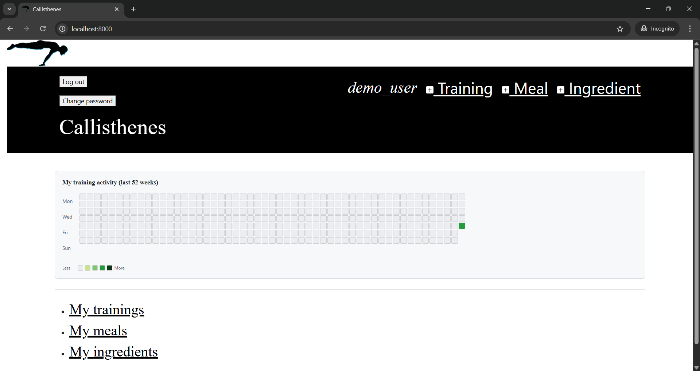
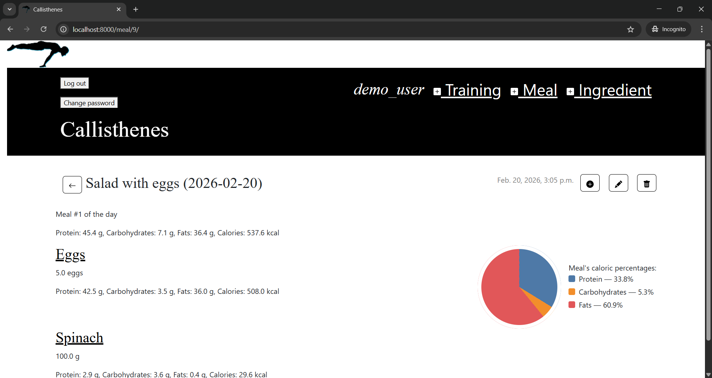
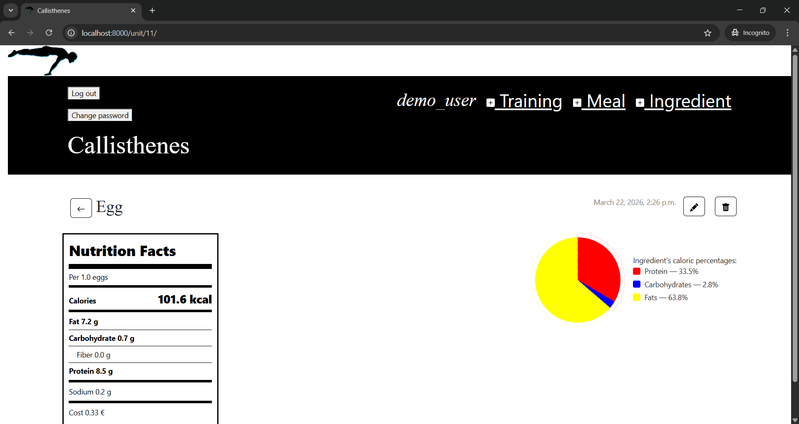
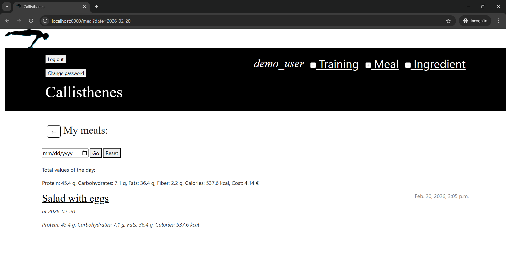

# [Callisthenes](https://callisthenes.eu.pythonanywhere.com)

[Callisthenes](https://callisthenes.eu.pythonanywhere.com) is a personal calisthenics training and nutrition tracking system

It is a work in progress and a practice project

Now its tech stack is:

* Python-Django back-end

* PostgreSQL/SQLite database

* HTML-CSS front-end

## Training tracking

### Trainings

The user can track trainings done at specified dates and the sets of exercises/skills/combos performed in a training.

### Sets

The user can track reps, resistance and more information about a set performed in a training.

## Nutrition tracking

### Ingredients

The user can create nutritional information profiles of ingredients.

### Meals

The user can track meals had at specified dates and the ingredients in a meal (with information about quantity, macronutrients and more).

## Example screenshots

### Training heatmap

### Macronutrient pie chart

### Ingredient nutrition facts

### Meals of a day

